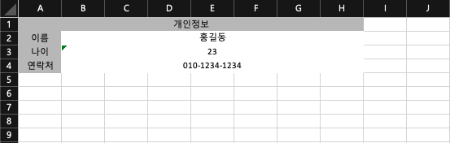

# Excel Module

# 1. Overview

Excel 파일을 읽고, 다운로드하고, 만드는 것을 데이터적인 면에서 쉽게 접근하기 위해 만든 모듈.

# 2. Feature

## 2.1 ExcelReader


```java
public interface ExcelReader<T> {

    void setFile(String filepath) throws ExcelReadException;
    void setFile(MultipartFile file) throws ExcelReadException;
    void setFile(InputStream is) throws ExcelReadException;
}
```

`ExcelReader` 는 다음과 같은 기능을 제공합니다.

- 읽을 파일을 지정할 수 있는 `setFile()`. 파일에 대해서 각각 filepath, file, input-stream 을 인자로 받아 읽을 엑셀파일을 처리합니다.

### 2.1.1 GridExcelReader (23.08.22 추가)

```java
public interface GridExcelReader<T> extends ExcelReader<T> {

    List<T> read() throws ExcelReadException;
    List<T> read(int headerSkipCount) throws ExcelReadException;
    
}
```

기존 `ExcelReader` 에서는 Grid 에 대한 엑셀만 처리했다면, 기능을 조금 더 확장하고 명확하게 하기 위해 `ExcelReader` 를 확장한 `GridExcelReader` 를 만들었습니다.

이 `GridExcelReader` 는 `ExcelReader` 에서 `setFile` 로 읽은 엑셀파일에 대해서 Generic T 타입의 List 형태로 값을 반환합니다.

`GridExcelReader` 를 구현한 추상 클래스로는 `AbstractGridExcelReader` 가 있습니다.

### 2.1.3 How To Use

사용법은 다음과 같습니다.

#### 2.1.3.1 ReflectGridExcelReader

`ReflectGridExcelReader` 는 *읽을 데이터를 저장할 객체*(이하 *obj*) 를 Reflect 로 처리한 Reader 입니다.

다음과 같은 Excel 파일을 읽을 때,

|No|이름|성별|이메일|
|---|---|---|---|
|1|이름1|M|test1@mail.com|
|2|이름2|W|test2@mail.com|
|3|이름3|M|test3@mail.com|

*obj* 는 다음과 같이 작성할 수 있습니다.

```java
@Data               // reflect 를 위한 lombok annotation
@NoArgsConstructor  // reflect 를 위한 lombok annotation
public class MemberExcelReadModel {

    // ReflectGridExcelReader 는 ExcelTitle 어노테이션을 기반으로 동작합니다.
    // 이 때, value 는 읽을 Excel 의 header 를 작성해주셔야 정상적으로 No (header) 에 해당하는 row 값들 (1, 2, 3) 이 MemberExcelReadModel 객체에 매핑됩니다.
    @ExcelTitle(value = "No")
    String id;
    @ExcelTitle(value = "이름")
    String name;
    @ExcelTitle(value = "성별")
    String gender;
    @ExcelTitle(value = "이메일")
    String email;
}
```

> Reflect 를 이용한 GridExcelReader 이므로, 각 `ExcelTitle` 어노테이션을 가진 필드들의 setter 메소드는 필수이며, 기본생성자 또한 필수입니다.

이제, *obj* 를 이용하여, 다음과 같이 작성할 수 있습니다.

```java
@RestController
public class ExcelController {
    
    @PostMapping(value="/member/batch/read")
    public JsonResult batch(@RequestParam("attachFile") MultipartFile file) {
        try {
            GridExcelReader<MemberExcelReadModel> memberExcelReader = new ReflectGridExcelReader<>(MemberExcelReadModel.class);
            memberExcelReader.setFile(file);
            return JsonResult.success(memberExcelReader.read());   
        } catch (ExcelReadException e) {
            return JsonResult.fail(e.getMessage());
        }
    }
}
```

결과는 다음과 같습니다.

```json
{
  "data": [
    {"id": "1", "name": "이름1", "gender": "M", "email": "test1@mail.com"},
    {"id": "2", "name": "이름2", "gender": "W", "email": "test2@mail.com"},
    {"id": "3", "name": "이름3", "gender": "M", "email": "test3@mail.com"}
  ] 
}
```

> `ReflectGridExcelReader` 는 현재 Field 들의 타입이 String 일 때에만 지원하고 있습니다. 다른 primitive 타입 이나 String 에 대해서는 추가 개발 계획입니다.

> `ReflectGridExcelReader` 는 `ExcelTitle` 어노테이션이 존재하지 않을 시, 모든 Field 들에 대해서 **순서대로** 값을 바인딩 합니다. 즉, `ExcelTitle` 어노테이션은 필수가 아닙니다.


#### 2.1.3.2 MapExcelReader

`MapExcelReader`는 Reflect 를 이용한 방법보다 데이터지향적인 접근 방식입니다.

위의 2.1.3.1 `ReflectExcelReader` 에서 사용한 Excel 파일을 `MapExcelReader` 로는 다음과 같이 사용할 수 있습니다.

```java
@RestController
public class ExcelController {
    
    @PostMapping(value="/member/batch/read")
    public JsonResult batch(@RequestParam("attachFile") MultipartFile file) {
        try {
            ExcelReader<Map> mapExcelReader = new MapExcelReader();
            mapExcelReader.setFile(file);
            return JsonResult.success(mapExcelReader.read());
        } catch (ExcelReadException e) {
            return JsonResult.fail(e.getMessage());
        }
    }
}
```

결과는 다음과 같습니다.

```json
{
  "data": [
    {"No": "1", "이름": "이름1", "성별": "M", "이메일": "test1@mail.com"},
    {"No": "2", "이름": "이름2", "성별": "W", "이메일": "test2@mail.com"},
    {"No": "3", "이름": "이름3", "성별": "M", "이메일": "test3@mail.com"}
  ] 
}
```

이 때, Key 값을 다르게 맵핑하고 싶은 경우에는 `MapExcelReader` 인스턴스를 생성할 때 Mapping 할 Map 을 생성자 인자로 넣어주시면 됩니다.

```java
@RestController
public class ExcelController {
    
    @PostMapping(value="/member/batch/read")
    public JsonResult batch(@RequestParam("attachFile") MultipartFile file) {
        try {
            // ExcelReader<Map> mapExcelReader = new MapExcelReader();
            // mapExcelReader.setFile(file);
            // return JsonResult.success(mapExcelReader.read());
            Map<String, String> keyMap = new HashMap<>();
            keyMap.put("No", "no");
            keyMap.put("이름", "name");
            keyMap.put("성별", "gender");
            keyMap.put("이메일", "email");
            ExcelReader<Map> mapExcelReader = new MapExcelReader(keyMap);
            mapExcelReader.setFile(file);
            return JsonResult.success(mapExcelReader.read());
        } catch (ExcelReadException e) {
            return JsonResult.fail(e.getMessage());
        }
    }
}
```

결과는 다음과 같습니다.

```json
{
  "data": [
    {"no": "1", "name": "이름1", "gender": "M", "email": "test1@mail.com"},
    {"no": "2", "name": "이름2", "gender": "W", "email": "test2@mail.com"},
    {"no": "3", "name": "이름3", "gender": "M", "email": "test3@mail.com"}
  ] 
}
```


### 2.1.4 확장성

기존 구현해놓은 `AbstractGridExcelReader` 가 마음에 들지 않거나, 확장한 구현체인 `ReflectGridExcelReader` 혹은 `MapExcelReader` 의 기능이 부족할 때에는 확장하여 사용하시면 됩니다.

예를 들어, `getCellValue(Cell cell)` 메소드는 cell 값을 읽어서 String 으로 반환하는 메소드이며, 다음과 같이 구현되어 있습니다.

```java
protected String getCellValue(Cell cell) {
        String result = null;
        switch (cell.getCellType()) {
            case STRING:
                result = cell.getStringCellValue();
                break;
            case NUMERIC:
                if ( DateUtil.isCellDateFormatted(cell) ) { // date format
                    LocalDateTime ldt = cell.getLocalDateTimeCellValue();
                    result = ldt.toString();
                } else {
                    result = String.format("%.0f", cell.getNumericCellValue());
                }
                break;
            case BLANK:
                result = "";
                break;
            default:
                log.warn("허용되지 않은 엑셀 데이터 유형입니다. 파일을 확인해주세요. CellType :: {}", cell.getCellType());
        }

        return result;
    }
```

이보다 더 다양한 CellType 에 대해서 확장하고 싶을 경우, 확장하고 싶은 클래스를 확장하면 됩니다.

```java
public class CustomMapExcelReader extends MapExcelReader {
    
    @Override // Override 하여 Custom
    protected String getCellValue(Cell cell) {
        String result = null;
        switch (cell.getCellType()) {
            // case custom 구현
        }

        return result;
    }
}
```

### 2.1.5 정적 기능

데이터베이스 혹은 다른 비즈니스 로직을 위한 엑셀 업로드 시, 간혹 어떠한 형태로 엑셀을 올려야 하는지, 양식이 필요할 때가 있습니다. 기본 양식 유무에 따라 사용자 경험이 달라질 수 있으니까요.

이에 따라, `AbstractGridExcelReader` 추상 클래스에는 `sampleDownload()` 라는 정적 메소드를 제공합니다.

```java
public abstract class AbstractExcelReader<T,H> implements ExcelReader<T> {
    ...
    
    public static void sampleDownload(HttpServletResponse response, String filename, Class<?> clazz) throws ExcelReadException {
        // do Something...
    }
    
    ...
}
```

> 해당 메소드는 `ReflectGridExcelWriter` 와 마찬가지로 Reflect 를 기반으로 동작합니다.

위의 2.1.3.1 `ReflectGridExcelReader` 에서 사용했던 *obj* 를 기반으로 예를 들면,

```java
@Data
@NoArgsConstructor
public class MemberExcelReadModel {

    // sampleDownload 를 위한 sample 값 지정
    @ExcelTitle(value = "No", sample = "1")     
    String id;
    @ExcelTitle(value = "이름", sample ="이름")
    String name;
    @ExcelTitle(value = "성별", sample = "M / W")
    String gender;
    @ExcelTitle(value = "이메일", sample = "test1234@naver.com")
    String email;
}
```
와 같이 사용할 수 있고, 다음과 같은 결과가 나옵니다.

|No|이름|성별|이메일|
|---|---|---|---|
|1|이름|M / W|test1234@naver.com|


## 2.2 ExcelWriter

```java
public interface ExcelWriter<T> {

    void generate(String filePath) throws ExcelWriteException;
    void generate(String filePath, String sheetName) throws ExcelWriteException;
    void download(HttpServletResponse response, String filename) throws ExcelWriteException;
    void download(HttpServletResponse response, String filename, String sheetName) throws ExcelWriteException;
    
}
```

`ExcelWriter` 는 다음과 같은 기능을 제공합니다.

- 지정한 Data List 를 기반으로 `generate()` 로 어디에 생성할지 지정(filePath) 하여엑셀 파일을 생성.
- 지정한 Data List 를 기반으로 `download()` 로 엑셀 다운로드 구현.

### 2.2.1 GridExcelWriter (23.08.22 추가)

```java
public interface GridExcelWriter<T> extends ExcelWriter<T> {
    void setDataList(List<T> dataList);
}
```

`ExcelReader` 와 마찬가지로, 기존 `ExcelWriter` 에서는 Grid 에 대한 엑셀만 처리했다면, 기능을 조금 더 확장하고 명확하게 하기 위해 `ExcelWriter` 를 확장한 `GridExcelWriter` 를 만들었습니다.

이 `GridExcelWriter` 는 `setDataList(List<T> dataList)` 메소드를 통해 write 할 표본 데이터 목록을 입력해줍니다.

`GridExcelWriter` 를 구현한 추상 클래스로는 `AbstractGridExcelWriter` 가 있습니다.

### 2.2.2 PointExcelWriter (23.08.22 추가)

```java
public interface PointExcelWriter<T> extends ExcelWriter<T> {
    void setData(T data);
    void setInputStream(InputStream in);
    void setStartPattern(String pattern);
    void setEndPattern(String pattern);
}
```

이 `PointExcelWriter` 는 `setData(T data)` 메소드를 통해 write 할 표본 데이터를 입력해주며,
`setInputStream(InputStream in)` 메소드를 통해 작성할 엑셀의 양식을 찾아옵니다.
`setStartPattern(String pattern)` 와 `setEndPattern(String pattern)` 을 통해, 특정 어노테이션이 없이, field 명에 대해서 pattern 으로 찾아 바인딩 할 수도 있습니다.

`PointExcelWriter` 를 구현한 추상 클래스로는 `AbstractPointExcelWriter` 가 있습니다.

> 기본 pattern 은 `${{ pattern }}` 입니다.

### 2.2.3 How To Use

사용법은 다음과 같습니다.

#### 2.2.3.1 ReflectGridExcelWriter

`ReflectGridExcelWriter` 는 Reader 와 마찬가지로 특정 Annotation 와 Reflect 를 통해 엑셀을 생성할 수 있습니다.

다음과 같은 객체(이하 *obj*)에 대한 목록이 있을 경우

```java
@Data
@AllArgsConstructor
@ExcelHeaderGroup(  // 여러개의 Header 를 설정할 수 있는 Annotation
        value = {
                @ExcelHeader(   // 한 Row 에 해당하는 Header 를 설정할 수 있는 Annotation
                        value = {"No", "이름", "성별", "이메일"},   // Header 값
                        cell = @CellConfig(color = Color.GREY_25),  // Header Cell Style
                        font = @FontConfig(isBold = true)           // Header Cell Font
                )
        }
)
public class MemberExcelWriteModel {

    @ExcelBody(1)   // body 에 적힐 순서를 알려주는 Annotation (부: header 와 마찬가지로, Cell style, font 적용 가능)
    Long id;
    @ExcelBody(2)
    String name;
    @ExcelBody(3)
    String gender;
    @ExcelBody(4)
    String email;
}

========================================
dataList ::
[
    MemberExcelWriteModel(id=0, name=test0, gender=W, email=test0@naver.com), 
    MemberExcelWriteModel(id=1, name=test1, gender=M, email=test1@naver.com), 
    MemberExcelWriteModel(id=2, name=test2, gender=M, email=test2@naver.com)
]
```

Response 에 대해서 다음과 같이 작성 할 수 있습니다.

```java
@RestController
public class ExcelController {
    
    @GetMapping(value = "/member/excel")
    public void excelDownload(HttpServletResponse response) {
        List<MemberExcelWriteModel> modelList = this.dummyMemberExcelList();
        GridExcelWriter<MemberExcelWriteModel> excelWriter = new ReflectGridExcelWriter<>(MemberExcelWriteModel.class);
        excelWriter.setDataList(modelList);
        try {
            excelWriter.download(response, "test12345.xlsx");
        } catch (ExcelWriteException e) {
            log.error("[{}] error :: {}", e.getClass().getSimpleName(), e.getMessage());
        }
    }
}
```

결과는 다음과 같습니다.


위 예제에서는 일반적인 기능을 보여드렸으며, 

어노테이션의 추가기능을 설명드리면,

`@ExcelHeaderGroup` 에는 Merge 기능이 있으며,

`@ExcelBody` 는 Field 뿐만 아니라, Method 에도 사용이 가능합니다. (단 return type 이 void 인 경우는 정상 동작하지 않을 수 있습니다.)

추가 기능에 대한 예는 다음과 같습니다.

```java
@Data
@AllArgsConstructor
@ExcelHeaderGroup(
        value = {
                @ExcelHeader(           // header 1열
                        value = {"No", "이름", "성별", "", "이메일"},
                        cell = @CellConfig(color = Color.GREY_25),
                        font = @FontConfig(isBold = true)
                )
              , @ExcelHeader(           // header 2열
                        value = {"", "", "남", "여", ""},
                        cell = @CellConfig(color = Color.GREY_25),
                        font = @FontConfig(isBold = true)
                )
        }
        , merge = {"A1:A2", "B1:B2", "C1:D1", "E1:E2"} // merge 기능
)
public class MemberExcelWriteModel {

    @ExcelBody(1)
    Long id;

//    @ExcelBody(2)
    String name;
//    @ExcelBody(3)
    String gender;
//    @ExcelBody(4)
    @ExcelBody(5)   // 기존 4번째 였던 email 이 merge 에 따라서 5번으로 밀림.
    String email;

    // name 을 아스타로 적용시키는데, 색상은 붉은색으로, Bold 처리.
    @ExcelBody(
            value = 2,
            font = @FontConfig(
                color = Color.RED,
                isBold = true
            )
    )
    public String getMaskingName() {
        return "****";
    }

    @ExcelBody(3)   // 3번 순서에는 남자인경우 표시
    public String getGenderManIndex() {
        return "M".equals(this.gender) ? "O" : "";
    }

    @ExcelBody(4)   // 4번 순서에는 여자인 경우 표시
    public String getGenderWomenIndex() {
        return "W".equals(this.gender) ? "O" : "";
    }
}
```

결과는 다음과 같습니다.


> `ReflectExcelWriter` 또한, `@ExcelBody` 어노테이션이 없을 경우, T ClassType 이 가지고 있는 Field 들에 대해서 getter 메소드들을 가져와서 값을 가져와 Cell 에 채워줍니다.
> 즉, `@ExcelBody` 어노테이션은 필수가 아닙니다.

#### 2.2.3.2 ReflectPointExcelWriter (23.08.22 추가)

`ReflectPointExcelWriter` 는 Reader 와 마찬가지로 특정 Annotation 와 Reflect 를 통해 엑셀을 생성할 수 있습니다.

다음과 같은 엑셀(sample2.xlsx)양식이 있고,


다음과 같은 객체(이하 *obj*)에 대한 데이터가 있을 경우

```java
@Getter
public class MemberExcelPointerModel {
    @ExcelPointer("B2")
    private String name = "홍길동";
    @ExcelPointer("B3")
    private int age = 23;
    @ExcelPointer("B4")
    private String hp = "010-1234-1234";
}
```

다음과 같이 사용할 수 있고,

```java
@RestController
public class ExcelController {
    
    @GetMapping(value = "/member/excel/mapper")
    public void excelMapperDownload(HttpServletResponse response) {
        String filePath = System.getProperty("user.dir") + File.separator + "files" + File.separator + "sample2.xlsx";
        PointExcelWriter<MemberExcelPointerModel> excelWriter = new ReflectPointExcelWriter<>(MemberExcelPointerModel.class);
        try {
            excelWriter.setInputStream(new FileInputStream(filePath));
            excelWriter.setData(new MemberExcelPointerModel());
            excelWriter.download(response, "mapper-test1234.xlsx");
        } catch (IOException e) {
            log.error(e.getMessage());
        }
    }
}
```

결과는 다음과 같습니다.



`ReflectPointExcelWriter` 의 `@ExcelPointer` 는 클래스의 Field 뿐만 아니라 Method 에 대해서도 사용이 가능합니다.

위의 *obj* 는 다음과 같이 사용할 수도 있습니다.

```java
@Getter
public class MemberExcelPointerModel {
    @ExcelPointer("B2")
    private String name = "홍길동";
    @ExcelPointer("B3")
    private int age = 23;
    // @ExcelPointer("B4")
    private String hp = "010-1234-1234";

    @ExcelPointer("B4")
    public String fixHp() {
        return "010-1234-1234";
    }
}
```

결과는 동일 합니다.

또한, `ReflectPointExcelWriter` 는 `@ExcelPointer` 없이도 사용이 가능합니다.

이 때는 양식이 조금 수정될 필요가 있습니다.

다음과 같이요.


해당 양식에 대해서는 `@ExcelPointer` 를 사용할 시 의도치 않은 결과가 나올 수 있습니다.

따라서, *obj* 를 다음과 같이 변경하고,

```java
@Getter
public class MemberExcelPointerModel {
    private String name = "홍길동";
    private int age = 23;
    private String hp = "010-1234-1234";
}
```

로직을 다음과 같이 수정하면,

```java
@RestController
public class ExcelController {

    @GetMapping(value = "/member/excel/mapper")
    public void excelMapperDownload(HttpServletResponse response) {
        
        String filePath = System.getProperty("user.dir") + File.separator + "files" + File.separator + "sample1_1.xlsx";
        PointExcelWriter<MemberExcelPointerModel> excelWriter = new ReflectPointExcelWriter<>(MemberExcelPointerModel.class);
        try {
            excelWriter.setInputStream(new FileInputStream(filePath));
            excelWriter.setData(new MemberExcelPointerModel());
            excelWriter.download(response, "mapper-test1234.xlsx");
        } catch (IOException e) {
            log.error(e.getMessage());
        }
    }
}
```

결과는 다음과 같이 나옵니다.


> 패턴을 변경하고 싶을 시, `setStartPattern(String pattern)` 과 `setEndPattern(String pattern)` 을 통해서 변경이 가능하고, `@ExcelPointer` 를 사용하지 않을 시에는, Method 에는 접근하지 않습니다.  

### 2.2.4 확장성

구현되어있는 구현체가 사용하기 어렵다면, 커스텀하게 확장하여서 사용할 수 있습니다.

# 3. Dependencies

해당 프로젝트는 Spring boot 를 기반으로 개발되어있으며,

Excel 관련 의존성은 다음과 같습니다.

```gradle
// https://mvnrepository.com/artifact/org.apache.poi/poi
implementation group: 'org.apache.poi', name: 'poi', version: '5.2.2'

// https://mvnrepository.com/artifact/org.apache.poi/poi-ooxml
implementation group: 'org.apache.poi', name: 'poi-ooxml', version: '5.2.2'
```
